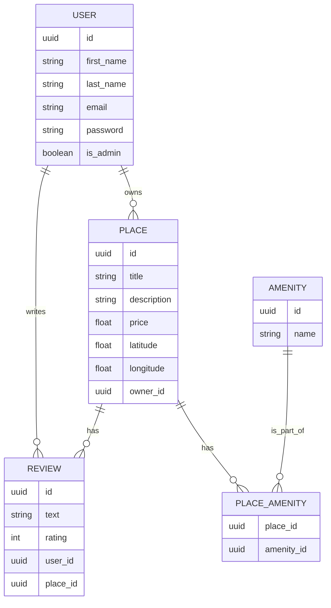

# ✨ HBnB - Part 3 : Advanced API & Database Integration

## 📌 Description

Bienvenue dans la **troisième partie** du projet **HBnB** !  
Ici, l’objectif est de construire une **API RESTful sécurisée**, reliée à une **base de données SQL** via **SQLAlchemy**, tout en respectant les bonnes pratiques :  
- 🔐 Authentification JWT  
- 🧂 Hashing des mots de passe  
- 🗂️ Repository Pattern  
- 🧠 Séparation des responsabilités

---

## 🧱 Architecture du projet

```plaintext
part3/
├── app/
│   ├── __init__.py             🎯 Application Factory
│   ├── config.py               🛠️ Configurations (Dev/Test/Prod)
│   ├── extensions.py           🔌 Initialisation des extensions (db, jwt, bcrypt)
│   ├── models/                 🧬 SQLAlchemy Models (User, Place, Review, Amenity…)
│   ├── repositories/           🗂️ SQLAlchemy et InMemory Repositories
│   ├── api/
│   │   └── v1/                 🔐 Endpoints organisés par entité
│   ├── facade.py               🧠 Façade métier
│   ├── SQL_tables.sql          🧾 Script création DB
│   ├── Insert_Initial_Data.sql 📥 Script données initiales
├── tests/                      🧪 Tests
```

---

## 🗃️ Fonctionnalités par tâche

### ✅ 0. Application Factory  
📦 Intègre `Config` dans `create_app()`  
🔌 Initialise `db`, `bcrypt`, `jwt`  

### ✅ 1. User + Password Hashing  
🔐 Hash sécurisé avec `bcrypt`  
🙅‍♂️ Mot de passe non retourné dans les réponses  
🧾 Création via `POST /api/v1/users/`

### ✅ 2. JWT Authentification  
🪪 Auth via `POST /api/v1/auth/login`  
📲 Retourne un token JWT  
🔐 Protection des endpoints avec `@jwt_required`

### ✅ 3. Endpoints utilisateur authentifié  
🔏 Accès restreint pour :  
🔄 Modifier ses infos  
🏠 Créer / modifier ses places  
📝 Rédiger une review (avec restrictions)

### ✅ 4. Droits administrateur  
👑 Admins peuvent :  
👤 Créer/modifier n’importe quel utilisateur  
🛠️ Gérer toutes les amenities  
🔓 Bypasser les restrictions (ownership, review unique…)

### ✅ 5. SQLAlchemy Repository  
📀 Remplace l’ancienne persistence mémoire  
🧩 Intégré à la `Facade`  
🔁 Respect du `Repository Pattern`

### ✅ 6. Mapping User SQLAlchemy  
🧬 Mapping complet de `User` + `BaseModel`  
🛠️ `UserRepository` fonctionnel  
🔐 Hachage toujours actif

### ✅ 7. Mapping Place, Review, Amenity  
📦 Mapping des attributs (sans relations)  
🧱 CRUD via les nouveaux Repositories

### ✅ 8. Relations SQLAlchemy  
🔗 Ajout des relations :  
🧍 `User` ↔ `Place`  
🏠 `Place` ↔ `Review`  
💡 `Place` ↔ `Amenity` (N:N)

### ✅ 9. Scripts SQL  
📜 `SQL_tables.sql` : création des tables  
📦 `Insert_Initial_Data.sql` : admin + données test  

💡 Utilisation :
```bash
sqlite3 dev.db < SQL_tables.sql
```

---

## ✅ 10. Diagramme ER (Mermaid.js)



---

## 🚀 Lancer l’application

```bash
export FLASK_APP=app
export FLASK_ENV=development
flask run
```

---

## 🔐 Auth avec JWT

### 🔑 Endpoint de login :
```http
POST /api/v1/auth/login
Body : { "email": "exemple@mail.com", "password": "mon_mdp" }
```

### Ensuite, inclure ce header dans les requêtes protégées :

```http
Authorization: Bearer <votre_token_jwt>
```

---

## 🧪 Tests

✔️ Couverture des fonctionnalités critiques :  
- ✅ Connexion et création utilisateur  
- ✅ Authentification et tokens  
- ✅ Droits d’accès (admin vs user)  
- ✅ Requêtes interdites (review double, lieu non possédé…)

---

## 📚 Ressources utiles

- 📘 [Flask Application Factory](https://flask.palletsprojects.com/en/2.3.x/patterns/appfactories/)
- 🧬 [SQLAlchemy ORM](https://docs.sqlalchemy.org/en/20/orm/)
- 🔐 [JWT avec Flask](https://flask-jwt-extended.readthedocs.io/)
- 🔑 [bcrypt pour Flask](https://flask-bcrypt.readthedocs.io/)
- 📊 [Mermaid.js Diagram](https://mermaid.live)

---

## ✍️ Auteurs

- 👨‍💻 Ilmi Veliu  
- 👨‍💻 Tom Lagarde
